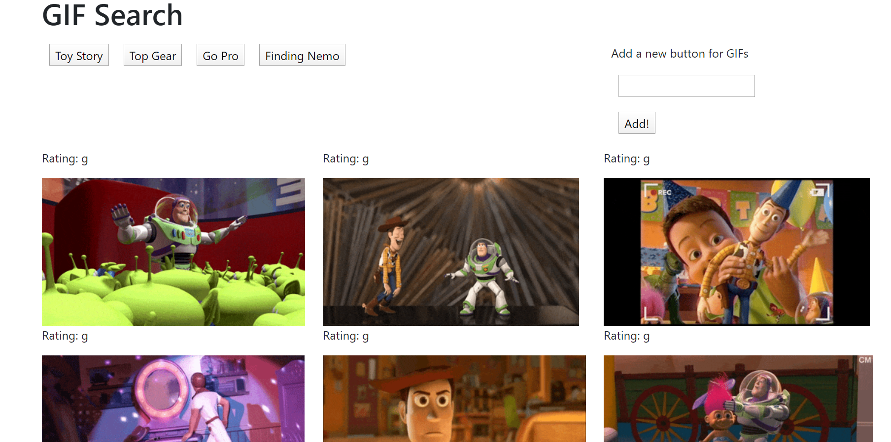
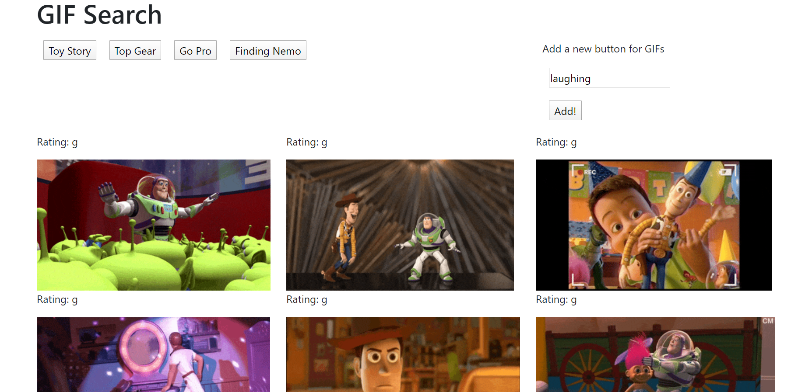
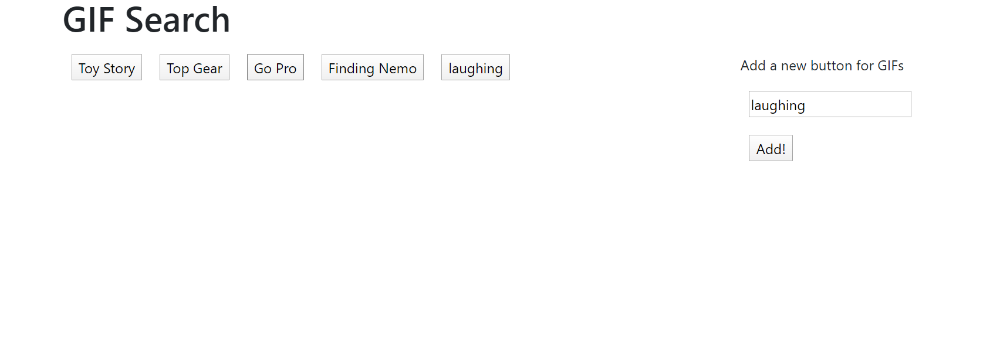
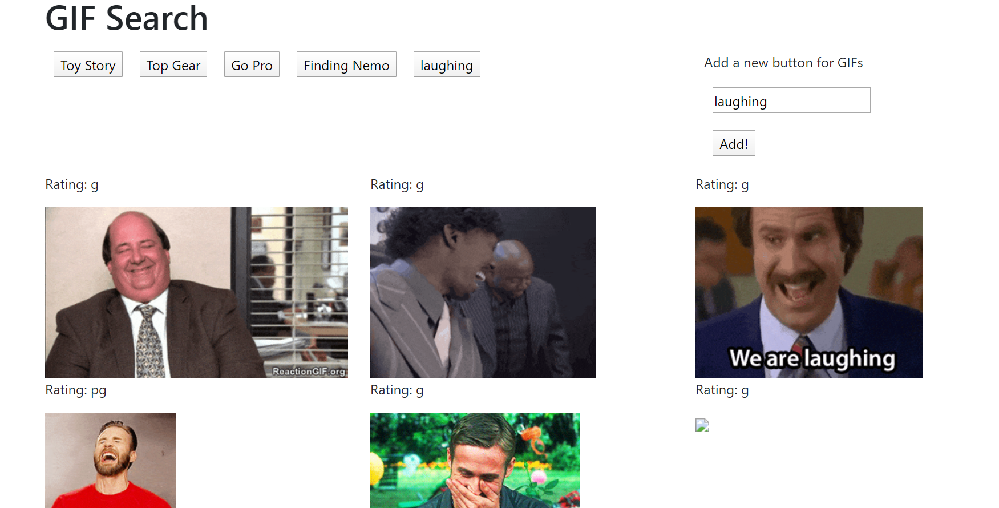

#  WELCOME TO GIFTASTIC

This webpage project is called GifTastic.

It was made to explore:
* how to set up API calls from Giphy
* adding buttons with a search query
* filtering through ratings 
* putting in a pause and play function by click the GIF image

## Snapshot of the webpage:

## Guide to this project:

* Step 1: Click on the link - https://arif2301.github.io/gifTastic/ to go to the webpage. Then start by searching for a subject

* Step 2: As you can see the button is now added

* Step 3: Click on the button to see the images. Click on a particular image to start and stop the GIF

Thank you for veiwing this project.
